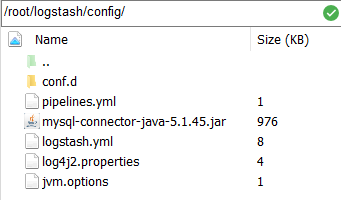
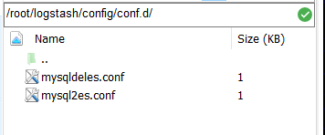
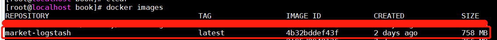
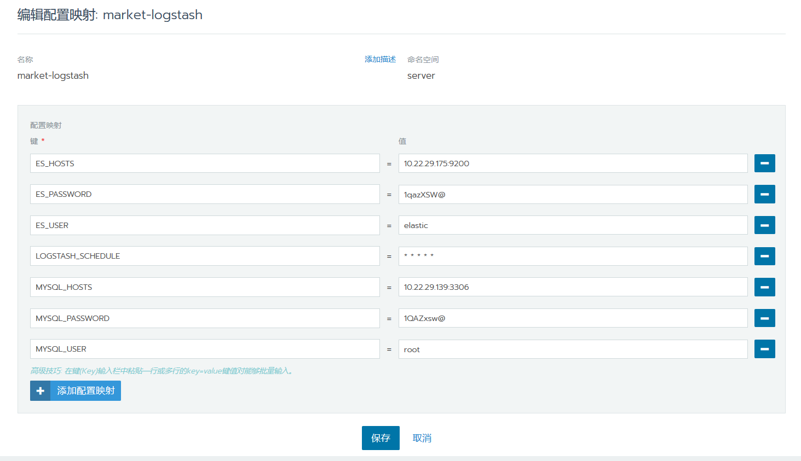
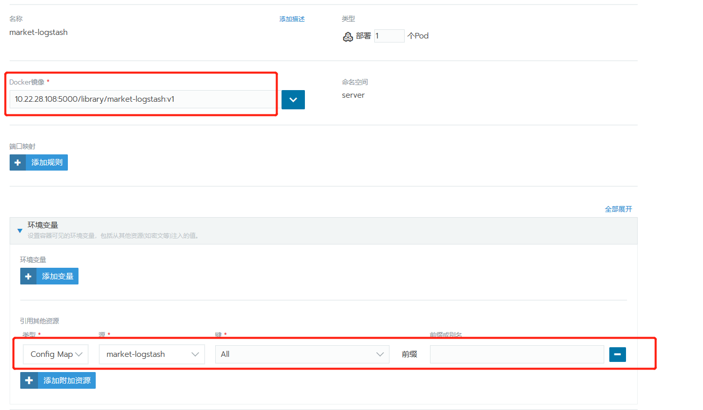
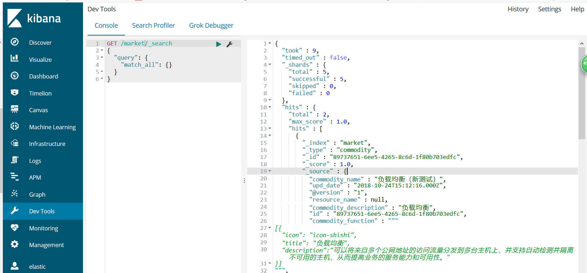

# 例子说明：

1. 从mysql的表中收集数据，写入elasticsearch中。 根据UPD_DATE>:sql_last_value的条件做增量同步
2. 表中删除的数据，删除elasticsearch。根据IS_DELETED=0 and UPD_DATE>:sql_last_value条件判断数据是否被删除。
3. 使用pipelines的方式，启动
4. 打包成私有镜像，并在rancher集群发布（直接docker运行）

# 步骤

##  目录配置




## pipelines.yml
```
   - pipeline.id: main1
     path.config: "/usr/share/logstash/config/conf.d/mysql2es.conf"
     pipeline.workers: 2
   - pipeline.id: main2
     path.config: "/usr/share/logstash/config/conf.d/mysqldeles.conf"
     pipeline.workers: 2
```

 在不带参数的情况下启动Logstash时，它将读取pipelines.yml文件并实例化文件中指定的所有管道。 另一方面，当使用-e或-f时，Logstash会忽略pipelines.yml文件并记录警告。

## mysql2es.conf

```
input {
 stdin { }
    jdbc {
        jdbc_connection_string => "jdbc:mysql://${MYSQL_HOSTS}/cloud_marketplace?useSSL=false"
        jdbc_user => "${MYSQL_USER}"
        jdbc_password => "${MYSQL_PASSWORD}"
        jdbc_driver_library => "/usr/share/logstash/config/mysql-connector-java-5.1.45.jar"
        jdbc_driver_class => "com.mysql.jdbc.Driver" 
        jdbc_paging_enabled => "true"
        jdbc_page_size => "50000"   
        statement => "SELECT COMMODITY_ID ID,RESOURCE_NAME,COMMODITY_NAME,COMMODITY_DESCRIPTION,COMMODITY_FUNCTION,COMMODITY_ADVANTAGE,UPD_DATE FROM STORE_COMMODITY_T market where IS_DELETED=0 and UPD_DATE>:sql_last_value"
        last_run_metadata_path => "/usr/share/logstash/config/station_parameter.txt"
        schedule => "${LOGSTASH_SCHEDULE:* * * * *}"
    }
}
  
output {  
    stdout {
         codec => json_lines
    }
    elasticsearch {
        hosts => "${ES_HOSTS}"
        user => "${ES_USER}"
        password => "${ES_PASSWORD}"
        action => "index"
        index => "market"
        document_type => "commodity"    
        document_id => "%{id}"
    }
}
```

jdbc_connection_string：连接数据的连接字符串
jdbc_user：数据库用户名
jdbc_password：数据库密码
jdbc_driver_library：连接数据库的驱动文件
jdbc_driver_class：数据库驱动类
jdbc_paging_enabled：是否支持分页
jdbc_page_size：每页的大小
statement：查询语句
last_run_metadata_path：sql_last_value值会保持在last_run_metadata_path指定的文件中，并且下次执行sql后会更新这个值为当前的时间。
schedule：执行schedule的表达式。* * * * * ：每分钟都执行。

hosts：elasticsearch的ip地址
user：当elasticsearch设置的用户密码时，需要指定此参数
password：当elasticsearch设置的用户密码时，需要指定此参数
action：可以设置index/delete/，表示操作elasticsearch的动作
index：数据保存在elasticsearch中的index
document_type：数据保存在elasticsearch中的type。 这个type将会在elasticsearch7中被弃用。
document_id：elasticsearch中的唯一标识

${LOGSTASH_SCHEDULE:* * * * *}：这种表达方式，logstash启动后，会读取环境变量LOGSTASH_SCHEDULE的值，如果未读到会采用“:”后设定的缺省值。


## mysqldeles.conf

```
input {
 stdin { }
    jdbc {
        jdbc_connection_string => "jdbc:mysql://${MYSQL_HOSTS}/cloud_marketplace?useSSL=false"
        jdbc_user => "${MYSQL_USER}"
        jdbc_password => "${MYSQL_PASSWORD}"
        jdbc_driver_library => "/usr/share/logstash/config/mysql-connector-java-5.1.45.jar"
        jdbc_driver_class => "com.mysql.jdbc.Driver" 
        jdbc_paging_enabled => "true"
        jdbc_page_size => "50000"   
        statement => "SELECT COMMODITY_ID ID,RESOURCE_NAME,COMMODITY_NAME,COMMODITY_DESCRIPTION,COMMODITY_FUNCTION,COMMODITY_ADVANTAGE,UPD_DATE FROM STORE_COMMODITY_T market where IS_DELETED=1 and UPD_DATE>:sql_last_value"
        last_run_metadata_path => "/usr/share/logstash/config/station_parameter_del.txt"
        schedule => "${LOGSTASH_SCHEDULE:* * * * *}"
    }
}
  
output {  
      stdout {
           codec => json_lines
      }
      elasticsearch {
          hosts => "${ES_HOSTS}"
          user => "${ES_USER}"
          password => "${ES_PASSWORD}"
          action => "delete"
          index => "market"
          document_type => "commodity"    
          document_id => "%{id}"
      }
}
```

## docker直接运行

```
docker run -d --name market-logstash -e MYSQL_HOSTS="10.22.29.139:3306" -e MYSQL_USER="root" -e MYSQL_PASSWORD="1QAZxsw@" -e ES_HOSTS="10.22.29.175:9200" -e LOGSTASH_SCHEDULE="* * * * *" market-logstash
```

## 制作自己的镜像

Dockerfile (此文件放在/root/logstash路径下)

```
FROM openjdk:8-jre

RUN apt-get update
RUN wget -qO - https://artifacts.elastic.co/GPG-KEY-elasticsearch | apt-key add -
RUN apt-get install apt-transport-https -y

RUN ln -sf /usr/share/zoneinfo/Asia/Shanghai /etc/localtime
RUN echo 'LANG="en_US.UTF-8"' >> /etc/profile
RUN . /etc/profile

RUN echo "deb https://artifacts.elastic.co/packages/6.x/apt stable main" | tee -a /etc/apt/sources.list.d/elastic-6.x.list
RUN apt-get update && apt-get install logstash

COPY ./config /usr/share/logstash/config/
CMD ["/usr/share/logstash/bin/logstash"]
```
制作镜像

```
docker build -t market-logstash .
```

镜像制作完成后，用docker images命令查看镜像



给镜像打标签

```
docker tag market-logstash:latest 10.22.28.108:5000/library/market-logstash:v1
```

包镜像推到私有镜像仓库

```
docker push 10.22.28.108:5000/library/market-logstash:v1
```

## rancher的配置

配置configMap（设置环境变量）



部署服务



过一段时间，程序执行后，可以通过kibana查看elasticsearch的内容

