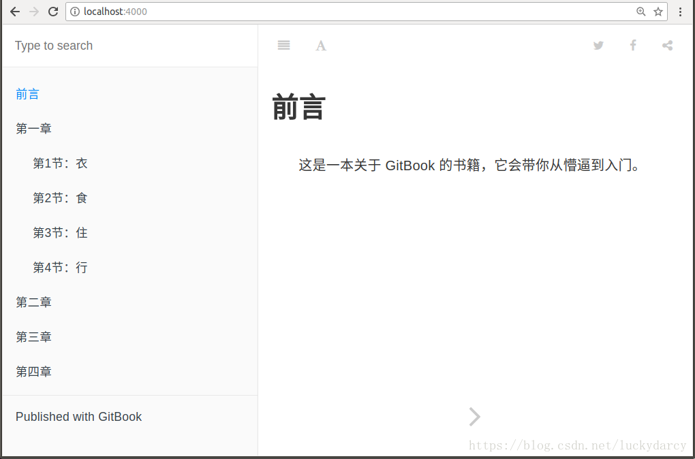

现在安装 Node.js 都会默认安装 npm（node 包管理工具），所以我们不用单独安装 npm，打开命令行，执行以下命令安装 GitBook：
```
npm install -g gitbook-cli
```
　安装完之后，就会多了一个 gitbook 命令（如果没有，请确认上面的命令是否加了 -g）。

怎么使用

1. 创建一个自己的目录，执行gitbook init
```
#mkdir mybook
#cd mybook/
#gitbook init
```
执行完后，你会看到多了两个文件 —— README.md 和 SUMMARY.md，它们的作用如下：

README.md —— 书籍的介绍写在这个文件里
SUMMARY.md —— 书籍的目录结构在这里配置

编辑 SUMMARY.md 文件，内容修改为：

```
# 目录

* [前言](README.md)
* [第一章](Chapter1/README.md)
  * [第1节：衣](Chapter1/衣.md)
  * [第2节：食](Chapter1/食.md)
  * [第3节：住](Chapter1/住.md)
  * [第4节：行](Chapter1/行.md)
* [第二章](Chapter2/README.md)
* [第三章](Chapter3/README.md)
* [第四章](Chapter4/README.md)
```

接着我们执行 `gitbook serve` 来预览这本书籍，执行命令后会对 Markdown 格式的文档进行转换，默认转换为 html 格式，最后提示 “Serving book on [http://localhost:4000](http://localhost:4000/)”。



你可以执行 gitbook build 命令构建书籍，默认将生成的静态网站输出到 _book 目录。实际上，这一步也包含在 gitbook serve 里面，因为它们是 HTML，所以 GitBook 通过 Node.js 给你提供服务了。 

当然，build 命令可以指定路径：

```$ gitbook build [书籍路径] [输出路径]```
serve 命令也可以指定端口：

```$ gitbook serve --port 2333```
你还可以生成 PDF 格式的电子书：

```$ gitbook pdf ./ ./mybook.pdf```
生成 epub 格式的电子书：
```$ gitbook epub ./ ./mybook.epub```
生成 mobi 格式的电子书：
```$ gitbook mobi ./ ./mybook.mobi```
如果生成不了，你可能还需要安装一些工具，比如 ebook-convert。或者在 Typora 中安装 Pandoc 进行导出。