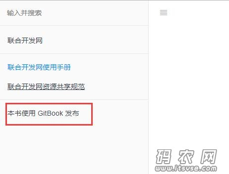
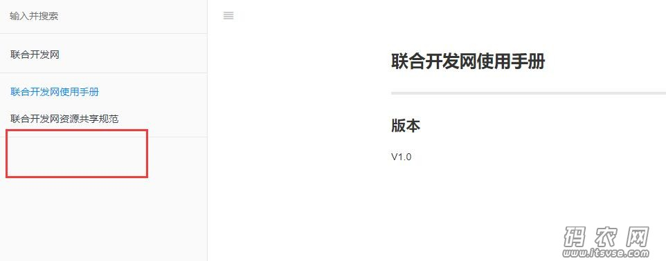

去掉publish信息

      

方案一：

 在生成的每个html文件种，删除如下代码：
```

<li>
    <a href="https://www.gitbook.com" target="blank" class="gitbook-link">
           ....
     </a>
</li>
```
复制代码

如果html页面太多的话，每次生成再删除比较麻烦，少量html页面可以，所有此方案不是太好。

 方案二：

 创建样式表文件“styles/website.css”，添加代码如下：

```
.gitbook-link {
    
    display: none !important;
    
}
```


 编辑“book.json”文件，添加如下代码：

```
{
    "styles": {
    "website": "styles/website.css"
    }
}
```
复制代码

我们编译输出一下，发现页面不在显示该信息，主要是用css把此div给隐藏掉了。

  