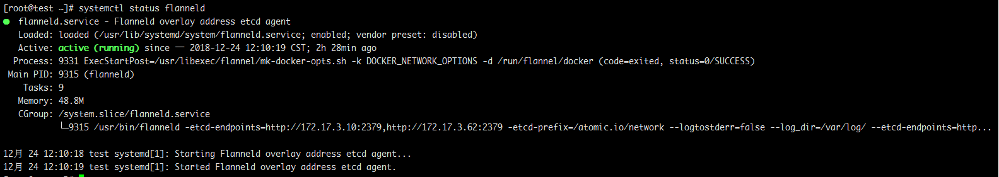

1. yum install flannel

2. 编辑flannel的配置文件
     vi /etc/sysconfig/flanneld
```
# Flanneld configuration options  

# etcd url location.  Point this to the server where etcd runs
FLANNEL_ETCD_ENDPOINTS="http://172.17.3.10:2379,http://172.17.3.62:2379"  #####etcd集群的地址，包括各个成员

# etcd config key.  This is the configuration key that flannel queries
# For address range assignment
FLANNEL_ETCD_PREFIX="/atomic.io/network"  ####自定义的子网目录，一定要和添加到etcd的子网目录一致

# Any additional options that you want to pass
#FLANNEL_OPTIONS=""
FLANNEL_OPTIONS="--logtostderr=false --log_dir=/var/log/ --etcd-endpoints=http://172.17.3.10:2379,http://172.17.3.62:2379 --iface=ens32"  ####定义了日志级别，路径，以及etcd集群地址和绑定的屋里网卡信息
```

再启动flannel之前需要向etcd内写入子网信息

etcdctl  mk **/k8s/network**/config '{"Network":"10.10.0.0/16", "SubnetMin": "10.10.1.0", "SubnetMax": "10.10.254.0"}'

上面的2处红色字体部分必须一致，可以自定义但是必须一致

子网范围为 10.10.0.0/16，最小子网开始为10.10.1.0 最大子网结束为10.10.254.0，至此自定义子网信息我们已经写入完毕。

接下来，我们来启动flannel，并设置为开机启动

systemctl start flanneld

systemctl enable flanneld

systemctl status flanneld




[root@localhost ~]# cat **/run/flannel/docker**
DOCKER_OPT_BIP="--bip=10.1.20.1/24"
DOCKER_OPT_IPMASQ="--ip-masq=true"
DOCKER_OPT_MTU="--mtu=1472"
DOCKER_NETWORK_OPTIONS=" --bip=10.1.20.1/24 --ip-masq=true --mtu=1472"


[root@localhost ~]# cat **/usr/lib/systemd/system/docker.service.d/flannel.conf**
[Service]
EnvironmentFile=-/run/flannel/docker

[root@localhost ~]# cat **/etc/sysconfig/flanneld**
\# Flanneld configuration options

\# etcd url location.  Point this to the server where etcd runs
FLANNEL_ETCD_ENDPOINTS="http://192.168.137.11:2379"

\# etcd config key.  This is the configuration key that flannel queries
\# For address range assignment
FLANNEL_ETCD_PREFIX="/k8s/network"

\# Any additional options that you want to pass
#FLANNEL_OPTIONS=""


