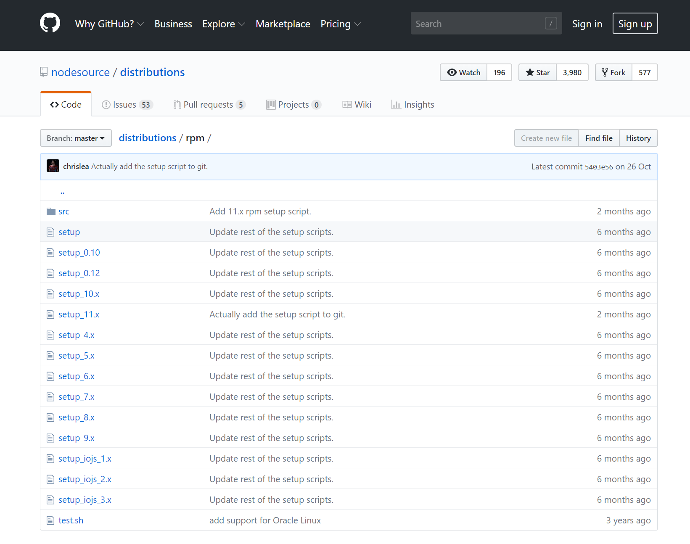
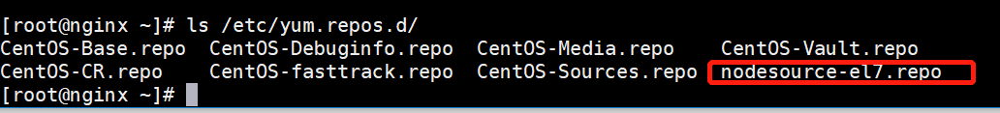

# nodejs安装（centos7）

## 1.  查询最新的nodejs版本

   https://github.com/nodesource/distributions/tree/master/rpm

   

## 2. 更新node.js版本yum源

   ```
   #curl --location https://rpm.nodesource.com/setup_11.x | bash -
   ```

更新后yum源会多一个文件



## 3. yum安装node.js

   ```
   #yum install -y nodejs
   ```

## 4. 查看node.js版本

   ```
   #node -v1
   ```

## 5. node.js版本管理器(nodejs安装会自动安装npm)
   ```
   #npm install -g n
   ```


# 版本管理n

## 1. 安装指定版本

   ```
 #n <version>1
   ```

## 2. 安装最新版本

   ```
   #n latest1
   ```

## 3. 安装稳定版本

   ```
   #n stable1
   ```

## 4. 删除某个版本

   ```
   #n rm <version> 1
   ```

## 5. 查看所有版本

   ```
   #n list
   ```