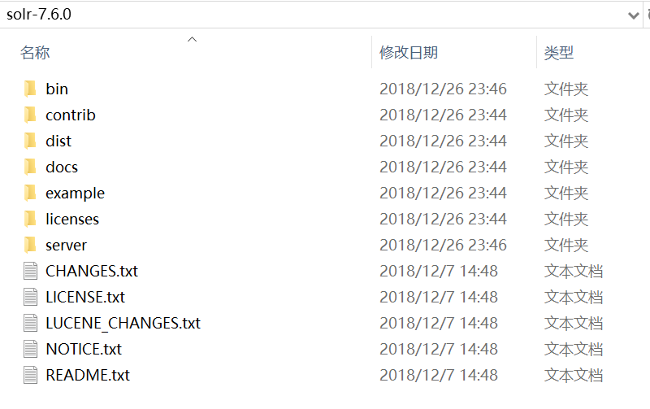

# solr 安装 独立模式

## 确保你已经安装了JDK和正确配置JAVA_HOME

http://lucene.apache.org/solr/downloads.html下载最新版本的solr。（以Solr7.6.0为例）
## 可用 Solr 软件包


Solr 可从 Solr 网站获取。您可以在此下载最新版本的 Solr：<https://lucene.apache.org/solr/mirrors-solr-latest-redir.html>。

Solr 有三个独立的软件包：

- solr-7.0.0.tgz：适用于 Linux / Unix / OSX 系统
- solr-7.0.0.zip：适用于 Microsoft Windows 系统
- solr-7.0.0-src.tgz：Solr 源代码包。如果您想在 Solr 上开发而不使用官方的 Git 存储库，这将非常有用。

   

## 目录布局

安装 Solr 之后，您将会看到以下的目录和文件：

- bin         

  此目录中包含几个重要的脚本，这些脚本将使使用 Solr 更容易。

  - solr 和 solr.cmd                 

    这是Solr 的控制脚本，也称为`bin/solr`（对于 * nix）或者`bin/solr.cmd`（对于 Windows）。这个脚本是启动和停止 Solr 的首选工具。您也可以在运行 SolrCloud 模式时创建集合或内核、配置身份验证以及配置文件。

  - post                 

    Post Tool，它提供了用于发布内容到 Solr 的一个简单的命令行界面。

  - solr.in.sh 和 solr.in.cmd                 

    这些分别是为 * nix 和 Windows 系统提供的属性文件。在这里配置了 Java、Jetty 和 Solr 的系统级属性。许多这些设置可以在使用`bin/solr`或者`bin/solr.cmd`时被覆盖，但这允许您在一个地方设置所有的属性。

  - install_solr_services.sh                 

    该脚本用于 * nix 系统以安装 Solr 作为服务。在 “将Solr用于生产 ” 一节中有更详细的描述。

- contrib         

  Solr 的`contrib`目录包含 Solr 专用功能的附加插件。 

- dist         

  该`dist`目录包含主要的 Solr .jar 文件。

- docs         

  该`docs`目录包括一个链接到在线 Javadocs 的 Solr。

- example         

  该`example`目录包括演示各种 Solr 功能的几种类型的示例。有关此目录中的内容的详细信息，请参阅下面的 Solr 示例。

- licenses         

  该`licenses`目录包括 Solr 使用的第三方库的所有许可证。

- server         

  此目录是 Solr 应用程序的核心所在。此目录中的 README 提供了详细的概述，但以下是一些特点：

  - Solr 的 Admin UI（`server/solr-webapp`）
  - Jetty 库（`server/lib`）
  - 日志文件（`server/logs`）和日志配置（`server/resources`）。有关如何自定义 Solr 的默认日志记录的详细信息，请参阅配置日志记录一节。
  - 示例配置（`server/solr/configsets`）

## Solr 示例

Solr 包括许多在开始时使用的示例文档和配置。如果您运行了 Solr 教程，您已经与这些文件中的某些文件进行了互动。

以下是 Solr 包含的示例：

exampledocs     

这是一系列简单的 CSV、XML 和 JSON 文件，可以在首次使用 Solr 时使用`bin/post`。有关和这些文件一起使用`bin/post`的更多信息，请参阅 Post 工具。

example-DIH     

此目录包含一些 DataImport Handler（DIH）示例，可帮助您开始在数据库、电子邮件服务器甚至 Atom 提要中导入结构化内容。每个示例将索引不同的数据集；有关这些示例的更多详细信息，请参阅 README。

files     

该`files`目录为您提供了一个基本的搜索 UI，可以用于文档（例如 Word 或 PDF），您可能已经存储在本地。有关如何使用此示例的详细信息，请参阅README。

films     

该`films`目录包含一组关于电影的强大数据，包括三种格式：CSV、XML 和 JSON。有关如何使用此数据集的详细信息，请参阅 README。

## 启动 Solr


Solr 包括一个名为 bin/solr（对于Linux / MacOS系统）或者 bin\solr.cmd（对于 Windows 系统）的命令行界面工具。此工具允许您启动和停止 Solr、创建核心和集合、配置身份验证和检查系统的状态。     


要使用它来启动 Solr，您只需输入：

```
bin/solr start
```

如果您正在运行 Windows，则可以通过运行 bin \ solr 来启动 Solr。

```
bin\solr.cmd start
```

这将在后台启动 Solr，监听端口 8983。

当您在后台启动 Solr 时，脚本将等待确认 Solr 在正确启动后再返回到命令行提示符。

```
Tip：Solr CLI 的所有选项都在 "Solr 控制脚本参考" 部分中介绍。
```

### 使用特定捆绑示例启动 Solr

Solr 还提供了一些有用的例子来帮助您了解主要功能。您可以使用该 -e 标志启动这些示例。例如，要启动 "techproducts" 示例，您可以执行以下操作：     


```
bin/solr -e techproducts
```

目前，您可以运行的可用示例是：techproducts、dih、schemaless 和 cloud。有关每个示例的详细信息，请参阅运行示例配置一节。

```
Note：SolrCloud 入门：
运行 cloud 示例以 SolrCloud 模式启动 Solr。有关在 cloud 模式下启动 Solr 的更多信息，请参阅“SolrCloud入门”部分。
```

### 检查 Solr 是否正在运行

如果您不确定 Solr 是否在本地运行，则可以使用 status 命令：

```
bin/solr status
```

这将搜索在您的计算机上运行的 Solr 实例，然后收集有关它们的基本信息，如版本和内存使用情况。

Solr 正在运行。如果您需要有说服力的证明，请使用 Web 浏览器查看管理控制台：http://localhost:8983/solr/

​      

如果 Solr 未运行，您的浏览器将提示无法连接到服务器。请检查您的端口号，然后进行重试。

### 创建核心

如果您没有使用示例配置启动 Solr，则需要创建一个核心才能进行索引和搜索。您可以运行以下操作：     


```
bin/solr create -c <name>
```

这将创建一个使用数据驱动模式的核心，当您将文档添加到索引时，该模式会尝试猜测正确的字段类型。

要查看创建新核心的所有可用选项，请执行以下操作：

```
bin/solr create -help
```