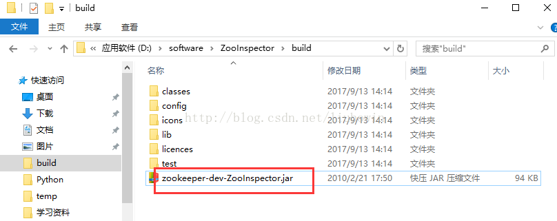
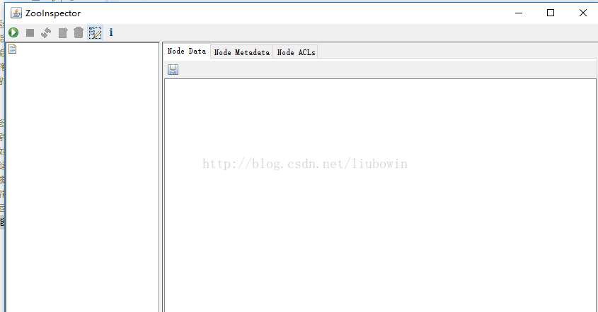
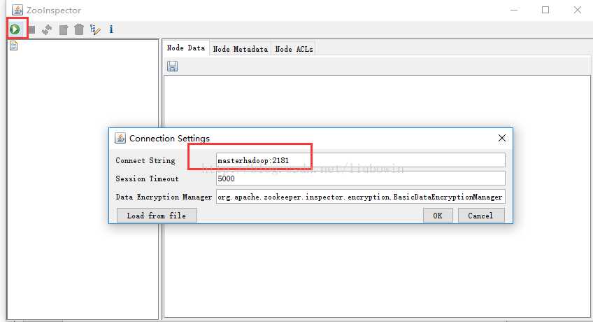
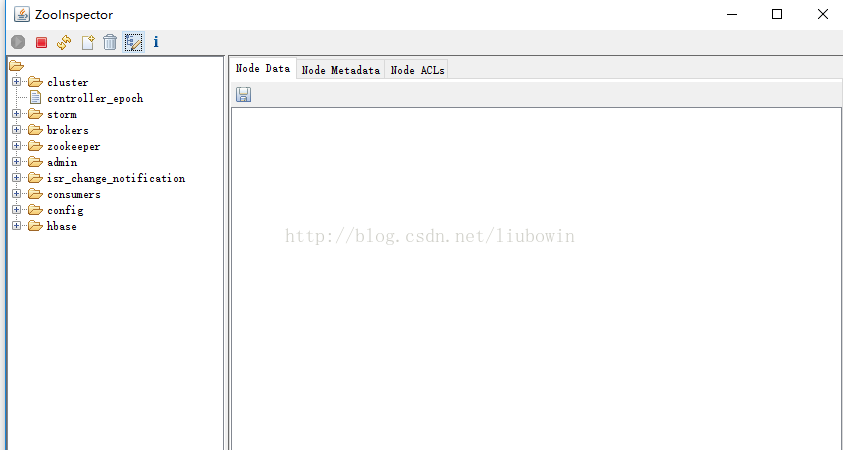

Zookeeper数据查看工具ZooInspector简介

原创 2017年09月13日 15:52:32

- 标签：
- [zookeeper](http://so.csdn.net/so/search/s.do?q=zookeeper&t=blog)

一、背景

Zookeeper作为常用的集群协调者组件被广泛应用，尤其是在大数据生态圈中；

Zookeeper集群存储各个节点信息，包括：Hadoop、Hbase、Storm、Kafka等等；

二、查询ZK数据的方式

那如何查看Zookeeper中的数据呢，我们可以通过ZkCli.sh命令客户端查看，但是不太直观，因为ZK本身数据是以树型结构存储组织的，

所以今天推荐一个实用的界面操作工具ZooInspector；

三、ZooInspector的使用

1、下载https://issues.apache.org/jira/secure/attachment/12436620/ZooInspector.zip；

2、解压，进入目录ZooInspector\build，运行zookeeper-dev-ZooInspector.jar；

​     

​     java -jar zookeeper-dev-ZooInspector.jar  //执行成功后，会弹出java ui client

​    

​    

3、点击左上角连接按钮，输入zk服务地址：ip:2181

​     

  点击OK，即可查看ZK节点信息

  

