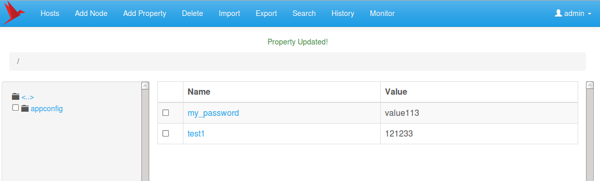
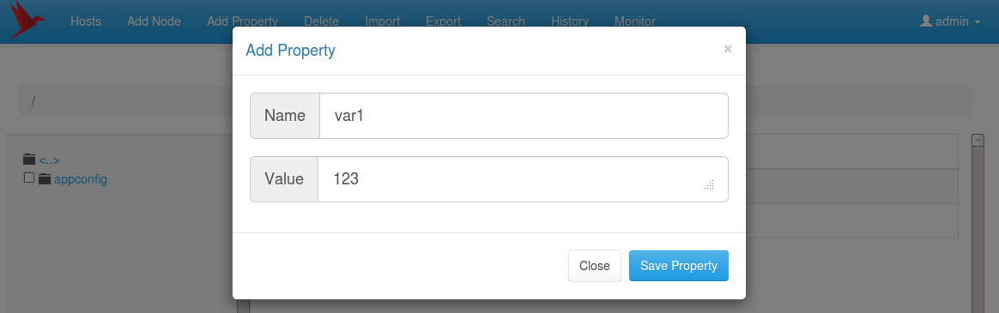
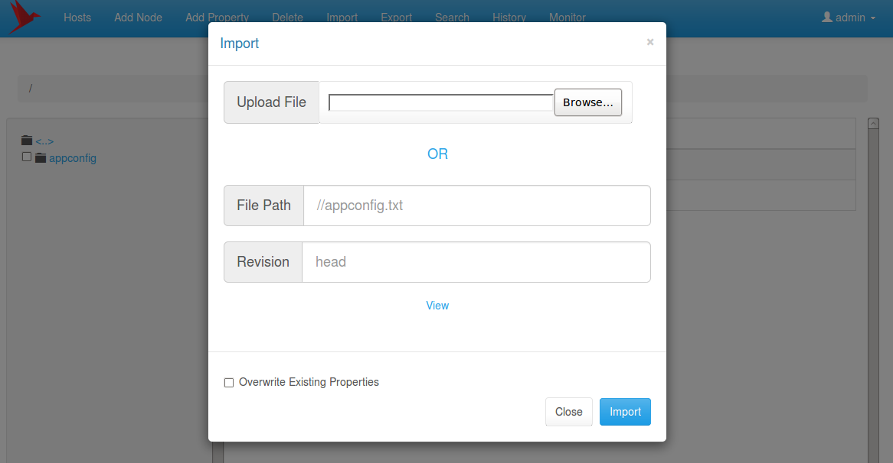
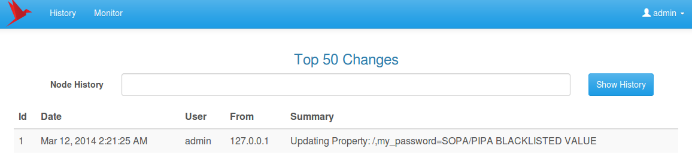
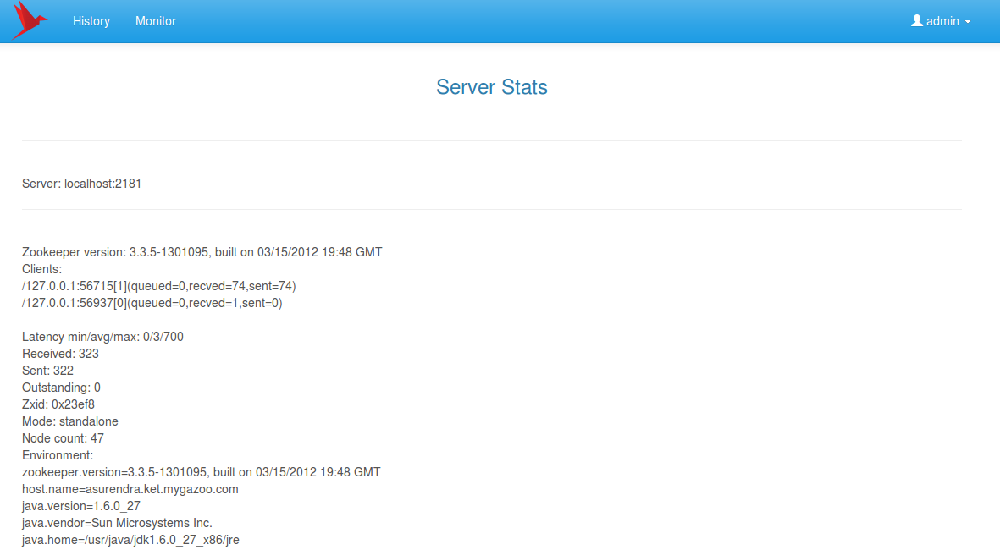

<https://github.com/DeemOpen/zkui>

# zkui - Zookeeper UI Da

shboard

## zkui - Zookeeper UI 看板

A UI dashboard that allows CRUD operations on Zookeeper.

这个UI看板可以在zookeepr上做CRUD的操作。

## Requirements

## 需求

Requires Java 7 to run.

需要Java 7+运行。

## Setup

## 安装

1. mvn clean install
2. Copy the config.cfg to the folder with the jar file. Modify it to point to the zookeeper instance. Multiple zk instances are coma separated. eg: server1:2181,server2:2181. First server should always be the leader.

​      拷贝config.cfg到jar文件路径。修改指向zookeeper实例。多个zk实例用逗号分隔。例  如：server1:2181，server2:2181。

1. Run the jar. ( nohup java -jar zkui-2.0-SNAPSHOT-jar-with-dependencies.jar & )
2. [http://localhost:9090](http://localhost:9090/)

## Login Info

## 登录

username: admin, pwd: manager (Admin privileges, CRUD operations supported) username: appconfig, pwd: appconfig (Readonly privileges, Read operations supported)

You can change this in the config.cfg

可以在config.cfg中配置。

## Technology Stack

## 技术栈

1. Embedded Jetty Server.
2. Freemarker template.
3. H2 DB.
4. Active JDBC.
5. JSON.
6. SLF4J.
7. Zookeeper.
8. Apache Commons File upload.
9. Bootstrap.
10. Jquery.
11. Flyway DB migration.

## Features

1. CRUD operation on zookeeper properties.

对zookeeper属性的增删改查

2. Export properties.

导出属性

3. Import properties via call back url.

通过url导入属性

4. Import properties via file upload.

通过文件导入属性

5. History of changes + Path specific history of changes.

操作历史查询

6. Search feature.

查找

7. Rest API for accessing Zookeeper properties.

Rest API访问Zookeeper属性

8. Basic Role based authentication.

基本的权限

9. LDAP authentication supported.

支持LDAP权限

10. Root node /zookeeper hidden for safety.

为安全考虑，隐藏了/zookeeper节点

11. ACL supported global level.

支持所有层次的访问控制列表

## Import File Format

## add property

/appconfig/path=property=value

## remove a property

-/path/property

You can either upload a file or specify a http url of the version control system that way all your zookeeper changes will be in version control.

## Export File Format

/appconfig/path=property=value

You can export a file and then use the same format to import.

## SOPA/PIPA BLACKLISTED VALUE

All password will be displayed as SOPA/PIPA BLACKLISTED VALUE for a normal user. Admins will be able to view and edit the actual value upon login. Password will be not shown on search / export / view for normal user. For a property to be eligible for black listing it should have (PWD / pwd / PASSWORD / password) in the property name.

## LDAP

If you want to use LDAP authentication provide the ldap url. This will take precedence over roleSet property file authentication. ldapUrl=ldap://<ldap_host>:<ldap_port>/dc=mycom,dc=com If you dont provide this then default roleSet file authentication will be used.

## REST call

A lot of times you require your shell scripts to be able to read properties from zookeeper. This can now be achieved with a http call. Password are not exposed via rest api for security reasons. The rest call is a read only operation requiring no authentication.

Eg: <http://localhost:9090/acd/appconfig?propNames=foo&host=myhost.com> This will first lookup the host name under /appconfig/hosts and then find out which path the host point to. Then it will look for the property under that path.

There are 2 additional properties that can be added to give better control. cluster=cluster1<http://localhost:9090/acd/appconfig?propNames=foo&cluster=cluster1&host=myhost.com> In this case the lookup will happen on lookup path + cluster1.

app=myapp <http://localhost:9090/acd/appconfig?propNames=foo&app=myapp&host=myhost.com> In this case the lookup will happen on lookup path + myapp.

A shell script will call this via MY_PROPERTY="$(curl -f -s -S -k "[http://localhost:9090/acd/appconfig?propNames=foo&host=`hostname](http://localhost:9090/acd/appconfig?propNames=foo&host=%60hostname) -f`" | cut -d '=' -f 2)" echo $MY_PROPERTY

## Standardization

Zookeeper doesnt enforce any order in which properties are stored and retrieved. ZKUI however organizes properties in the following manner for easy lookup. Each server/box has its hostname listed under /appconfig/hosts and that points to the path where properties reside for that path. So when the lookup for a property occurs over a rest call it first finds the hostname entry under /appconfig/hosts and then looks for that property in the location mentioned. eg: /appconfig/hosts/myserver.com=/appconfig/dev/app1 This means that when myserver.com tries to lookup the propery it looks under /appconfig/dev/app1

You can also append app name to make lookup easy. eg: /appconfig/hosts/myserver.com:testapp=/appconfig/dev/test/app1 eg: /appconfig/hosts/myserver.com:prodapp=/appconfig/dev/prod/app1

Lookup can be done by grouping of app and cluster. A cluster can have many apps under it. When the bootloader entry looks like this /appconfig/hosts/myserver.com=/appconfig/dev the rest lookup happens on the following paths. /appconfig/dev/.. /appconfig/dev/hostname.. /appconfig/dev/app.. /appconfig/dev/cluster.. /appconfig/dev/cluster/app..

This standardization is only needed if you choose to use the rest lookup. You can use zkui to update properties in general without worry about this organizing structure.

## HTTPS

You can enable https if needed. keytool -keystore keystore -alias jetty -genkey -keyalg RSA

## Limitations

1. ACLs are fully supported but at a global level.

## Screenshots

Basic Role Based Authentication 

Dashboard Console 

CRUD Operations 

Import Feature 

Track History of changes 

Status of Zookeeper Servers 

## License & Contribution

ZKUI is released under the Apache 2.0 license. Comments, bugs, pull requests, and other contributions are all welcomed!

Thanks to Jozef Krajčovič for creating the logo which has been used in the project.<https://www.iconfinder.com/iconsets/origami-birds>

本机环境：nohup java -jar /zookeeper/zkui-master/target/zkui-2.0-SNAPSHOT-jar-with-dependencies.jar &

访问地址：<http://192.168.137.102:9090>